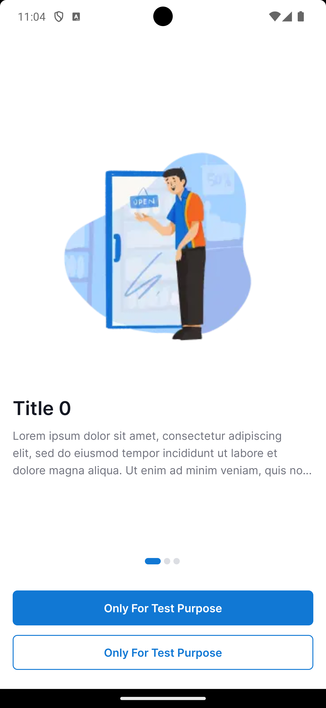
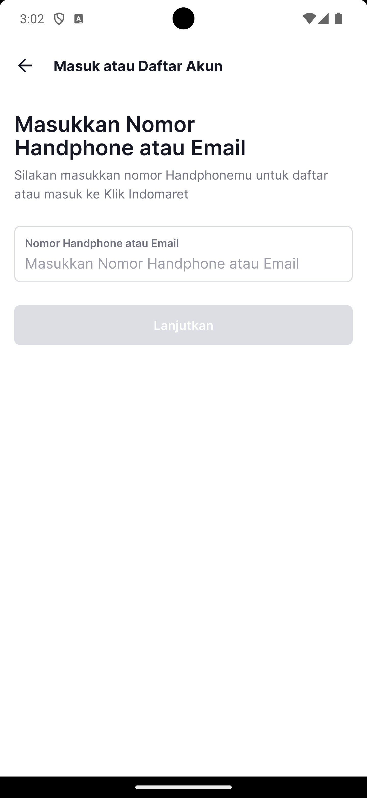

# ActionBar

## Overview

This section covers the usage of the ActionBar with the themes provided in the EDTS UI Kit, which are built on Material3 components. The EDTS UI Kit includes two themes specifically for managing the ActionBar:

- **Theme.EDTS.UIKit**: A base theme that removes the ActionBar.
- **Theme.EDTS.UIKit.ActionBar**: A theme that includes the ActionBar.
- 
## Image Comparison

Below is a visual comparison of the two themes, showing how the UI looks with and without the ActionBar.

| **Theme Without ActionBar**                                                   | **Theme With ActionBar**                                                          |
|-------------------------------------------------------------------------------|-----------------------------------------------------------------------------------|
|  |  |
