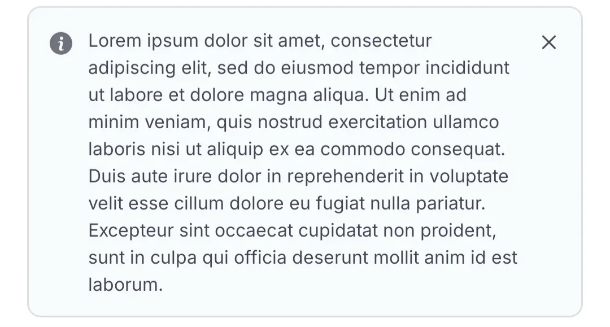
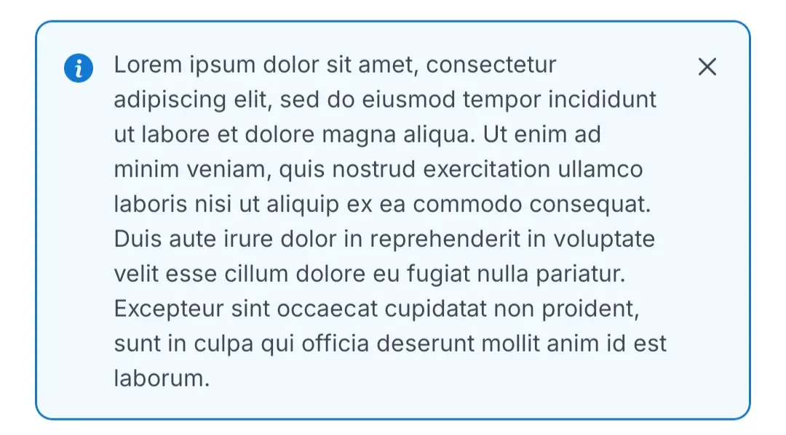
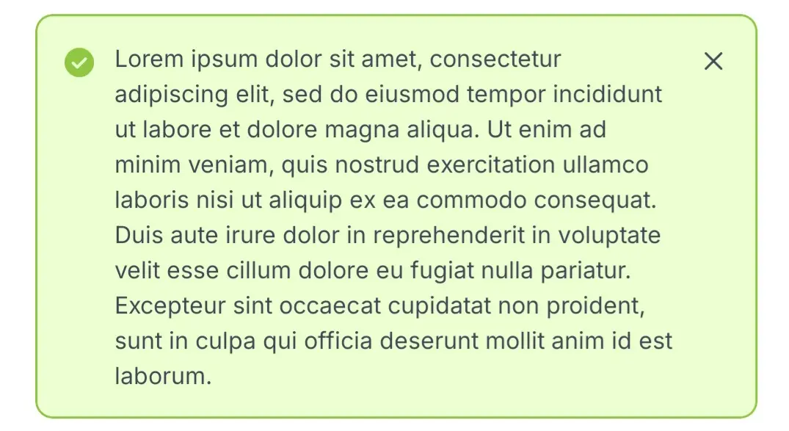
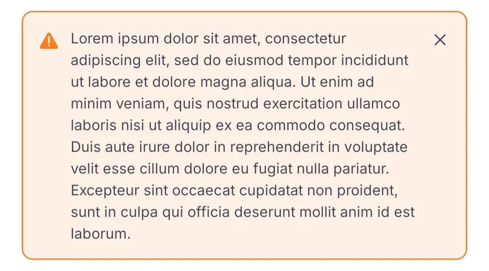
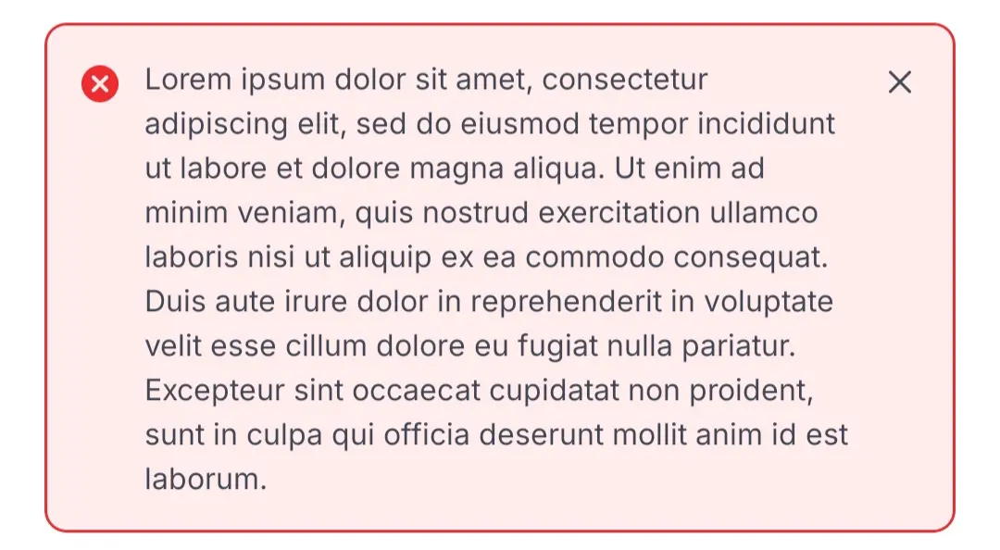
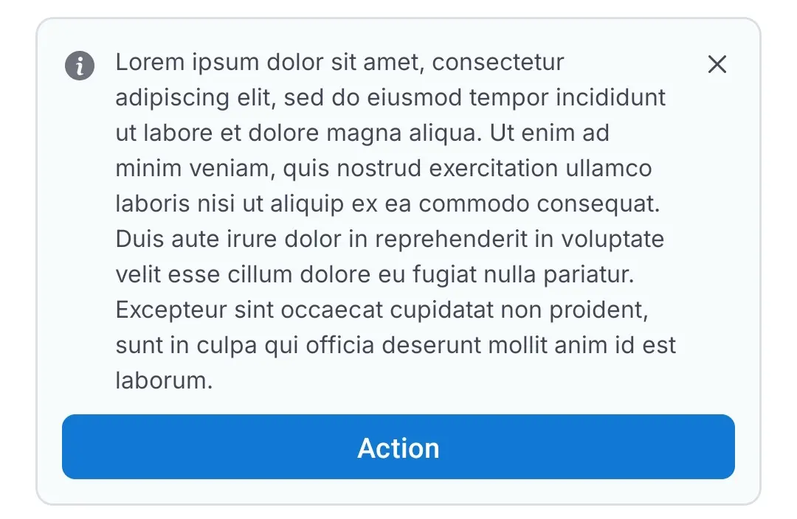

# AlertBox

## Overview

The `AlertBox` class is an easy-to-use, customizable UI component designed to display alert messages within Android applications. This component enhances user experience by providing context-specific alerts with icons, colors, and optional interaction through a close button.

## Key Features

-   **Predefined Alert Types**: Includes `SUCCESS`, `ERROR`, `WARNING`, `INFO`, and `LIGHT` for standardized feedback.
-   **Customizable Attributes**: Allows for setting different styles.
-   **Delegate Pattern Support**: Enables close button interaction with a customizable callback through `AlertBoxDelegate`.

## AlertBox Overview

| AlertBox Style  | Description                                               |
|-----------------|-----------------------------------------------------------|
| **Light**       |       |
| **Info**        |        |
| **Success**     |     |
| **Warning**     |     |
| **Error**       |       |
| **With Button** |  |


| Close Animation                                                                                           |
|-----------------------------------------------------------------------------------------------------------|
|  |

>In order to use animation shown above, use `animateLayoutChanges="true"` in Parent ViewGroup of the AlertBox.

## AlertType Enum

The `AlertType` enum determines the appearance of the `AlertBox`. Available types:

-   `SUCCESS`
-   `ERROR`
-   `WARNING`
-   `INFO`
-   `LIGHT`

Each type comes with specific:

-   **Background color**
-   **Text color**
-   **Stroke color**
-   **Icon**

## Usage Example

### XML Layout

```xml
<id.co.edtslib.uikit.alert.AlertBox
    android:id="@+id/alertBox"
    android:layout_width="match_parent"
    android:layout_height="wrap_content"
    app:alertType="error"
    app:text="This is an error alert." />
```

### Kotlin Code

```kotlin
alertBox.apply {
    alertType = AlertBox.AlertType.SUCCESS
    text = "Your operation was successful!"
    delegate = object : AlertBoxDelegate {
        override fun onCloseClickListener(view: View) {
            // Handle close button click
        }
        override fun onButtonClickListener(view: View) {
            // Handle action button click
        }
    }
}
```

## Customization Options

| Property               | Description                                                                 |
|------------------------|-----------------------------------------------------------------------------|
| `alertType`            | Enum to define alert style (`SUCCESS`, `ERROR`, `WARNING`, `INFO`, `LIGHT`) |
| `text`                 | Message to display                                                          |
| `textColor`            | Message color                                                               |
| `textAppearance`       | Style for the text appearance                                               |
| `cornerRadius`         | Radius for card corners                                                     |
| `strokeWidth`          | Width of the border stroke                                                  |
| `strokeColor`          | Color of the border stroke                                                  |
| `alertBackgroundColor` | Background color of the alert                                               |
| `startIcon`            | Drawable shown on the left                                                  |
| `startIconTint`        | Tint for the start icon                                                     |
| `isStartIconVisible`   | Whether to show start icon                                                  |
| `closeIcon`            | Drawable for the close icon                                                 |
| `closeIconTint`        | Tint for the close icon                                                     |
| `isCloseIconVisible`   | Whether to show the close icon                                              |
| `buttonText`           | Text for the optional action button                                         |
| `buttonType`           | Enum for button style (e.g., `FILLED`, custom)                              |
| `isButtonVisible`      | Whether to show the button                                                  |

## Attributes Reference

| XML Attribute            | Type      | Description              |
|--------------------------|-----------|--------------------------|
| `app:alertType`          | enum      | Alert style              |
| `app:text`               | string    | Alert message            |
| `app:textColor`          | color     | Message text color       |
| `app:textAppearance`     | style     | Text appearance          |
| `app:strokeWidth`        | dimension | Border thickness         |
| `app:strokeColor`        | color     | Border color             |
| `app:cornerRadius`       | dimension | Corner radius            |
| `app:backgroundColor`    | color     | Background color         |
| `app:startIcon`          | drawable  | Icon on the left         |
| `app:startIconTint`      | color     | Tint for start icon      |
| `app:isStartIconVisible` | boolean   | Toggle start icon        |
| `app:closeIcon`          | drawable  | Close icon drawable      |
| `app:closeIconTint`      | color     | Tint for close icon      |
| `app:isCloseIconVisible` | boolean   | Toggle close icon        |
| `app:buttonText`         | string    | Action button text       |
| `app:isButtonVisible`    | boolean   | Toggle button visibility |

## Delegate Interface

Implement `AlertBoxDelegate` to handle interaction:

```kotlin
interface AlertBoxDelegate { 
    fun onCloseClickListener(view: View)
    fun onButtonClickListener(view: View)
}
```

## Customization and Styling

The `AlertBox` can be styled using custom attributes or by setting properties programmatically. To match the app's visual design, ensure consistency with text appearance and color themes.