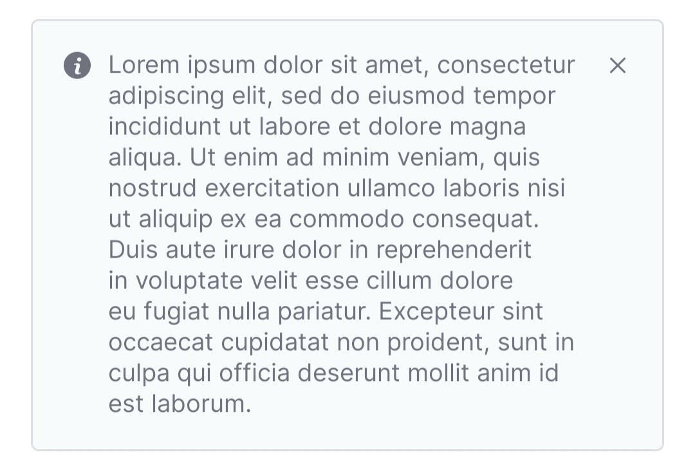
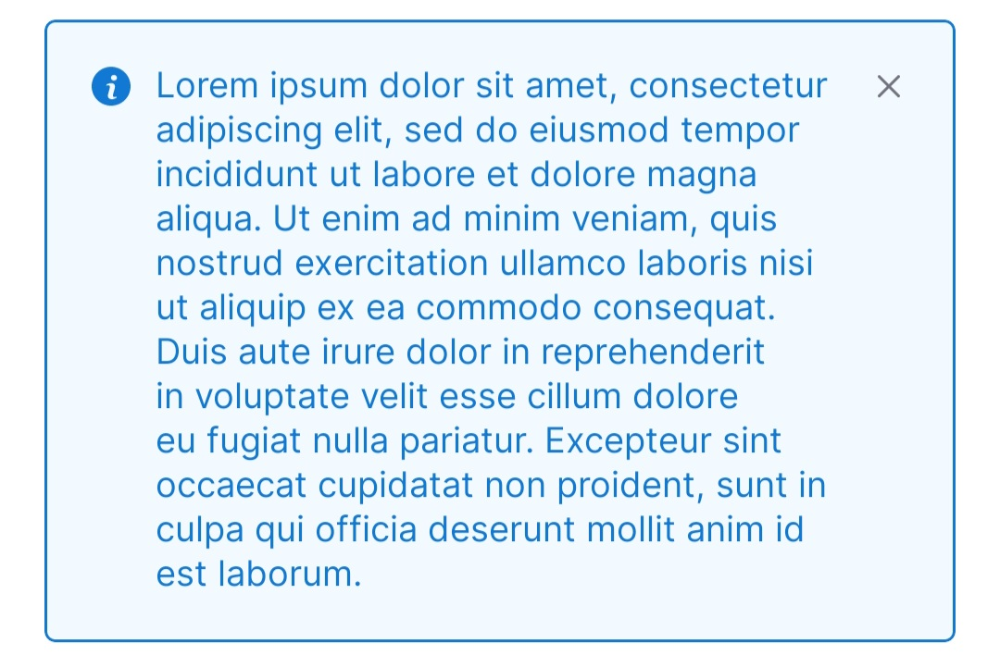
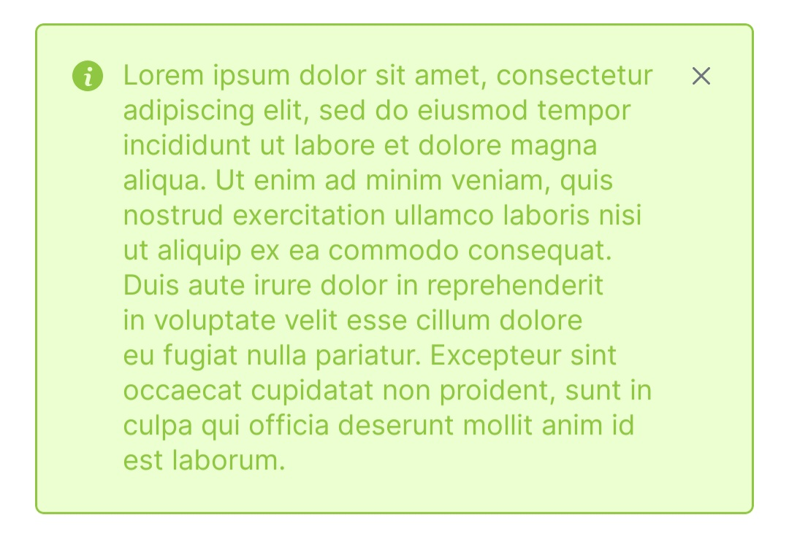
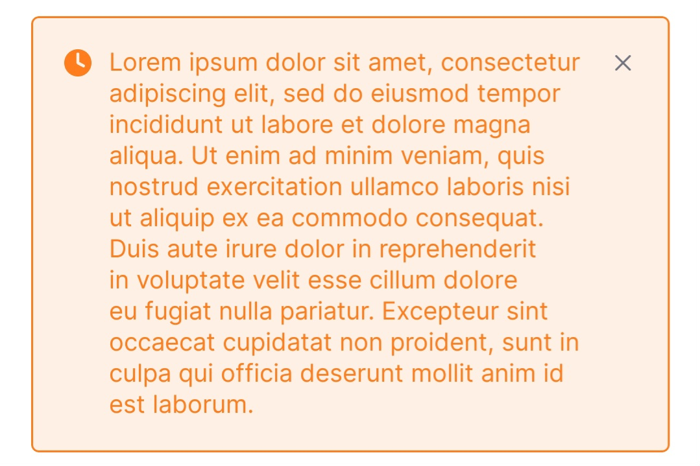
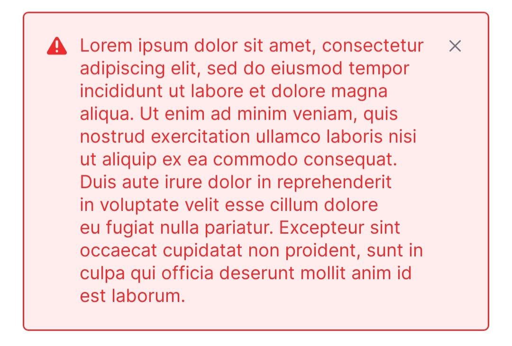

# AlertBox

## Overview

The `AlertBox` class is an easy-to-use, customizable UI component designed to display alert messages within Android applications. This component enhances user experience by providing context-specific alerts with icons, colors, and optional interaction through a close button.

## Key Features

-   **Predefined Alert Types**: Includes `SUCCESS`, `ERROR`, `WARNING`, `INFO`, and `LIGHT` for standardized feedback.
-   **Customizable Text Appearance**: Allows for setting different text styles.
-   **Icon and Color Binding**: Automatically updates icons and colors according to the selected `AlertType`.
-   **Delegate Pattern Support**: Enables close button interaction with a customizable callback through `AlertBoxDelegate`.

## AlertBox Overview

| AlertBox Style | Description                               |
|----------------|-------------------------------------------|
| **Light**      |      |
| **Info**       |        |
| **Success**    |  |
| **Warning**    |  |
| **Error**      |      |


| Close Animation                                                                                           |
|-----------------------------------------------------------------------------------------------------------|
|  |

>In order to use animation shown above, use `animateLayoutChanges="true"` in Parent ViewGroup of the AlertBox.

## Properties

### Public Properties

-   **`delegate: AlertBoxDelegate?`**

    -   Interface for handling close button interactions.
-   **`alertType: AlertType`**

    -   Enum property for setting the type of alert. It updates the background, stroke, text color, and icon accordingly.
    -   Default: `AlertType.LIGHT`
-   **`textAppearance: Int`**

    -   Defines the style resource for the alert text appearance.
    -   Default: `R.style.TextAppearance_Inter_Regular_B2`
-   **`text: CharSequence`**

    -   The message displayed within the alert box.

## AlertType Enum

The `AlertType` enum determines the appearance of the `AlertBox`. Available types:

-   `SUCCESS`
-   `ERROR`
-   `WARNING`
-   `INFO`
-   `LIGHT`

Each type comes with specific:

-   **Background color**
-   **Text color**
-   **Stroke color**
-   **Icon**

## Usage Example

### XML Layout

```xml
<com.example.AlertBox
    android:id="@+id/alertBox"
    android:layout_width="match_parent"
    android:layout_height="wrap_content"
    app:alertType="error"
    app:text="This is an error alert."
    app:textAppearance="@style/TextAppearance_AppCompat_Body1" />
```

### Kotlin Code

```kotlin
alertBox.apply {
    alertType = AlertBox.AlertType.SUCCESS
    text = "Your operation was successful!"
    delegate = object : AlertBoxDelegate {
        override fun onCloseClickListener(view: View) {
            // Handle close button click
        }
    }
}
```

## Customization and Styling

The `AlertBox` can be styled using custom attributes or by setting properties programmatically. To match the app's visual design, ensure consistency with text appearance and color themes.