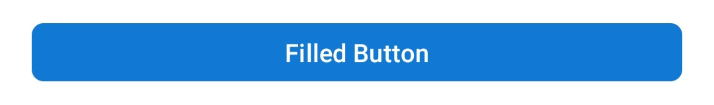
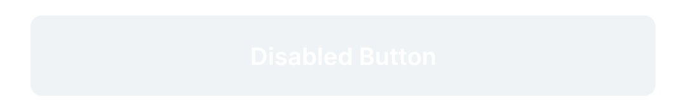
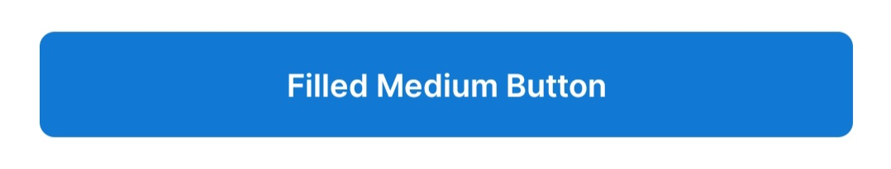
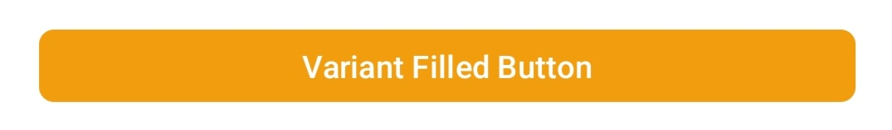
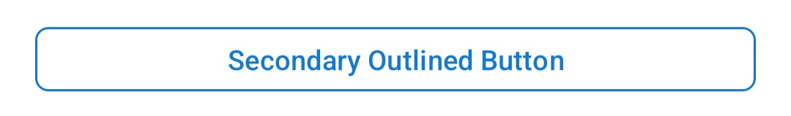
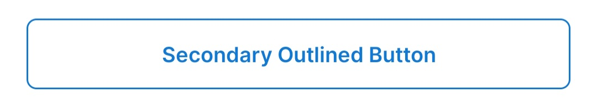

# Buttons

This document outlines the button styles available in the UI Kit. Each button style is designed to be customizable and easy to implement in your Android projects.

## Button Styles Overview

| Button Style                  | Description                                                                                             | Implementation Details                        | Preview                                                           | Disabled Preview                                                   |
|-------------------------------|---------------------------------------------------------------------------------------------------------|-----------------------------------------------|-------------------------------------------------------------------|--------------------------------------------------------------------|
| **Filled Button**             | A solid color button with text and icon color matching the theme. Ideal for primary actions.            | `Widget.EDTS.UIKit.Button.Filled`             |                        |              |
| **Filled Button Medium**      | A medium-sized filled button, suitable for secondary actions.                                           | `Widget.EDTS.UIKit.Button.Filled.Medium`      |          |       |
| **Filled Button Variant**     | A variant of the filled button with an alternative background color.                                    | `Widget.EDTS.UIKit.Button.Filled.Variant`     |               |      |
| **Outlined Button**           | A button with a transparent background and an outlined border. Ideal for secondary or tertiary actions. | `Widget.EDTS.UIKit.Button.Outlined`           |            |            |
| **Outlined Button Medium**    | A medium-sized outlined button with increased padding.                                                  | `Widget.EDTS.UIKit.Button.Outlined.Medium`    |     |     |
| **Outlined Button Secondary** | A secondary variant of the outlined button with a different stroke color.                               | `Widget.EDTS.UIKit.Button.Outlined.Secondary` |  |  |
| **Text Button**               | A text-only button with no background, suitable for less prominent actions.                             | `Widget.EDTS.UIKit.Button.TextButton`         | ```N/A```                                                         |                |
| **Text Button Medium**        | A medium-sized text button with added padding.                                                          | `Widget.EDTS.UIKit.Button.TextButton.Medium`  | ```N/A```                                                         |         |
| **Icon Button**               | A button designed primarily for icons with no text.                                                     | `Widget.EDTS.UIKit.Button.IconButton`         | ```N/A```                                                         |                |

**Implementation**:
```xml
<style name="Widget.EDTS.UIKit.Button.Filled" parent="Widget.Material3.Button.UnelevatedButton">
    <!-- Styles here -->
</style>
