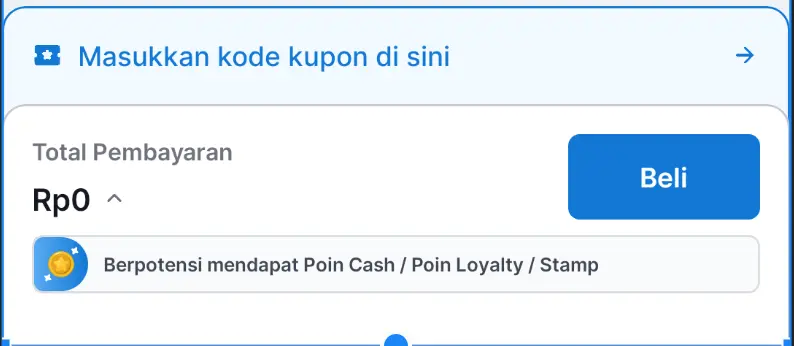

# Cart Footer

## Overview

| Type               | Visual                                                          |
|--------------------|-----------------------------------------------------------------|
| **Expanded State** |  |
| **Shrink State**   |    |

| Loading                                                                                                                                                          | Scrolling                                                                                                                                              |
|------------------------------------------------------------------------------------------------------------------------------------------------------------------|--------------------------------------------------------------------------------------------------------------------------------------------------------|
|  |  |

## Usage

### XML Layout

```xml
<id.co.edtslib.uikit.footer.CartFooter
    android:id="@+id/cartFooter"
    android:layout_width="match_parent"
    android:layout_height="wrap_content"
    app:infoText="Masukan kode kupon di sini"
    app:buttonText="Beli"
    app:isExpanded="true" />
```

### Kotlin

```kotlin
binding.cartFooter.apply {
    totalText = "Rp120.000"
    infoText = "Masukan Kode Kupon disini"
    buttonText = "Beli"
    isInfoSectionVisible = true
    isCashbackBadgeVisible = true
    isLoading = false

    delegate = object : CartFooterDelegate {
        override fun onActionButtonClick() {
            // Handle checkout
        }

        override fun onCouponSectionClick() {
            // Show coupon list
        }

        override fun onSummaryClick() {
            // Expand order summary
        }
    }

    attachToRecyclerView(binding.recyclerView)
}
```

## Public Properties

| Property                  | Type            | Description                                |
|---------------------------|-----------------|--------------------------------------------|
| `infoText`                | `CharSequence?` | Text shown in the coupon section           |
| `totalText`               | `CharSequence?` | Text shown in the total price label        |
| `buttonText`              | `CharSequence?` | Text for the main action button            |
| `isCouponSectionExpanded` | `Boolean`       | Controls bottom margin for coupon section  |
| `isInfoSectionVisible`    | `Boolean`       | Shows or hides the entire info section     |
| `isLoading`               | `Boolean`       | Enables shimmer loader and disables button |
| `isCashbackBadgeVisible`  | `Boolean`       | Shows/hides the cashback badge             |

## Sticky Footer Behavior

To ensure the footer sticks properly and avoids overlap, use:

```kotlin
cartFooter.attachToRecyclerView(recyclerView)
```

### Optional:

You can prevent padding injection with:

```kotlin
cartFooter.attachToRecyclerView(recyclerView, includePadding = false)
```

## Delegate Callbacks
Implement CartFooterDelegate to respond to user actions:

```kotlin
interface CartFooterDelegate {
     fun onActionButtonClick()
     fun onCouponSectionClick()
     fun onSummaryClick()
}
```

