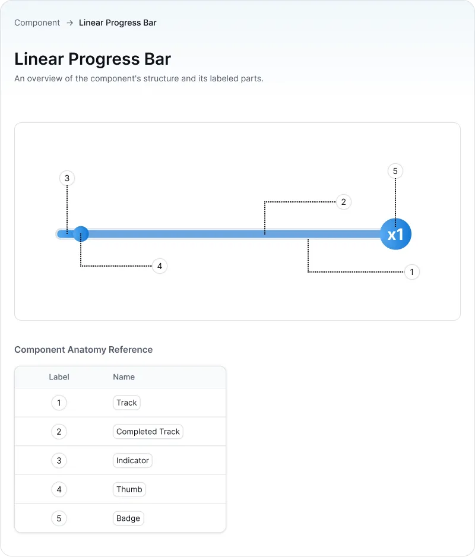
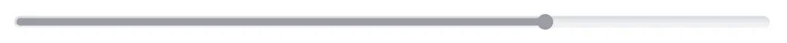

# LinearProgressBar Component

`LinearProgressBar` is a customizable Android custom `View` for displaying progress of single or multi lap progress and both determinate and indeterminate (loading) states, making it suitable for a wide range of progress-tracking use cases across an app.

---

## Features

- **Lap-Based Progress**: Progress values can exceed `maxIndicatorProgress`, wrapping into "laps." Each completed lap increments an automatic badge counter.
- **Loading State Handling**: `setLoadingStarted()` / `setLoadingFinished()` temporarily hide the thumb during async operations.
- **Indeterminate ("Intermittent") Mode**: Two indeterminate animation styles — `FIXED_WIDTH` (a sliding block) and `STRETCH` (a growing/shrinking segment) — for use when progress is unknown.
- **Debounced Progress Updates**: Rapid `indicatorProgress` changes are debounced (300ms) before animating, avoiding janky animation stacking.
- **XML Attribute Support**: Configure nearly all visual properties directly in XML layouts.

## Anatomy



`LinearProgressBar` is composed of the following visual parts:

| Part               | Description                                                                                                                | Related properties                                                                     |
|--------------------|----------------------------------------------------------------------------------------------------------------------------|----------------------------------------------------------------------------------------|
| **Track**          | The full-width background pill the indicator moves across.                                                                 | `trackColor`, `trackThickness`, `trackCornerRadius`, `trackPadding`                    |
| **Indicator**      | The filled segment representing current progress within the active lap, inset from the track edges.                        | `indicatorColor`, `indicatorPadding`, `setIndicatorGradient()`                         |
| **Thumb**          | The rounded handle that tracks the indicator's leading edge; hides during loading and intermittent animation.              | `thumbSize`, `thumbColor`, `thumbCornerRadius`, `showThumb`, `setThumbGradient()`      |
| **Badge**          | The `x{N}` pill showing how many laps have completed so far.                                                               | `showBadge`, `badgeCount` (auto-managed)                                               |
| **Completed fill** | Replaces the indicator across the *entire* track once a lap finishes, before the indicator resets and starts the next lap. | `completedIndicatorColor`, `showCompletedIndicator`, `setCompletedIndicatorGradient()` |


| State    | Visual                                                                                                    | Description                                                                                                                                     | 
|----------|-----------------------------------------------------------------------------------------------------------|-------------------------------------------------------------------------------------------------------------------------------------------------|
| Default  |  | The progress bar is in its default state.                                                                                                       |
| Disabled |                                               | The progress bar is disabled, does not respond to user input, and does not animate — progress changes are applied instantly with no transition. |


* * * * *

## Installation

Include the `LinearProgressBar` component in your layout file:

```xml
<id.co.edtslib.uikit.progressbar.LinearProgressBar
    android:id="@+id/linearProgressBar"
    android:layout_width="match_parent"
    android:layout_height="wrap_content"
    app:indicatorProgress="40"
    app:maxIndicatorProgress="100"
    app:progressLimit="500"
    app:trackThickness="6dp"
    app:thumbSize="16dp"
    app:showBadge="true"
    app:showThumb="true" />
```

* * * * *

## Usage

### 1. Setup in Kotlin

```kotlin
val progressBar = findViewById<LinearProgressBar>(R.id.linearProgressBar)

// Configure ranges
progressBar.maxIndicatorProgress = 100f   // value at which one "lap" completes
progressBar.progressLimit = 500f          // absolute ceiling across all laps

// Set progress (animates automatically)
progressBar.indicatorProgress = 40f

// Configure visuals
progressBar.indicatorColor = ContextCompat.getColor(this, R.color.primary_30)
progressBar.trackColor = ContextCompat.getColor(this, R.color.black_20)
progressBar.thumbColor = ContextCompat.getColor(this, R.color.primary_30)
progressBar.showThumb = true
progressBar.showBadge = true

// Setup delegate for per-frame animation callbacks
progressBar.delegate = object : LinearProgressBarDelegate {
    override fun onAnimationUpdateListener(
        view: View,
        currentProgressValue: Float,
        finalProgressValue: Float
    ) {
        // e.g. sync a percentage label with the animated value
        percentageLabel.text = "${currentProgressValue.toInt()}%"
    }
}
```

* * * * *

### 2. XML Attributes

| Attribute Name            | Type        | Default                      | Description                                               |
|---------------------------|-------------|------------------------------|-----------------------------------------------------------|
| `indicatorProgress`       | `float`     | `0f`                         | Current progress value (animated on change)               |
| `maxIndicatorProgress`    | `float`     | `100f`                       | Progress value at which one lap completes                 |
| `progressLimit`           | `float`     | `100f`                       | Absolute maximum progress value allowed, across all laps  |
| `shouldAnimate`           | `boolean`   | `true`                       | Whether progress changes animate or snap instantly        |
| `indicatorColor`          | `color`     | `primary_30`                 | Solid color of the progress indicator                     |
| `indicatorPadding`        | `dimension` | `1dp` (`dimen_1`)            | Inset of the indicator within the track                   |
| `trackColor`              | `color`     | `black_20`                   | Solid color of the background track                       |
| `trackThickness`          | `dimension` | `6dp` (`dimen_6`)            | Height of the track                                       |
| `trackCornerRadius`       | `dimension` | `trackThickness / 2`         | Corner radius of the track                                |
| `trackPadding`            | `dimension` | `0f`                         | Padding around the track within the view bounds           |
| `completedIndicatorColor` | `color`     | `primary_10`                 | Color shown across the full track once a lap is completed |
| `showCompletedIndicator`  | `boolean`   | `true`                       | Toggle visibility of the completed-lap fill               |
| `thumbSize`               | `dimension` | `8dp` (`dimen_8`)            | Diameter of the thumb                                     |
| `thumbCornerRadius`       | `dimension` | `thumbSize / 2`              | Corner radius of the thumb                                |
| `thumbColor`              | `color`     | `primary_30`                 | Solid color of the thumb                                  |
| `showThumb`               | `boolean`   | `true`                       | Toggle thumb visibility                                   |
| `innerShadowColor`        | `color`     | `progress_bar_black_opacity` | Color of the track's inner shadow                         |
| `innerShadowOffsetX`      | `float`     | `1`                          | Horizontal offset of the inner shadow (dp)                |
| `innerShadowOffsetY`      | `float`     | `2`                          | Vertical offset of the inner shadow (dp)                  |
| `innerShadowBlur`         | `float`     | `5`                          | Blur radius of the inner shadow                           |
| `showBadge`               | `boolean`   | `false`                       | Toggle visibility of the lap-count badge                  |

* * * * *

### 3. Delegate

Implement `LinearProgressBarDelegate` to receive per-frame updates while the progress animation is running:

```kotlin
interface LinearProgressBarDelegate {
    fun onAnimationUpdateListener(view: View, currentProgressValue: Float, finalProgressValue: Float)
}
```

| Parameter             | Description                                                        |
|------------------------|---------------------------------------------------------------------|
| `view`                 | The `LinearProgressBar` instance dispatching the callback            |
| `currentProgressValue` | The animated value for the current frame (clamped to `progressLimit`)|
| `finalProgressValue`   | The target value for the current animation segment                  |

* * * * *

### 4. Multi-Lap Progress


`LinearProgressBar` supports progress values greater than `maxIndicatorProgress`. When this happens:

- The visible indicator wraps back to `0` and animates again — a "lap."
- Each completed lap increments `badgeCount`, shown in the badge as `xN`.
- Between laps, a brief cross-fade ("lap transition") plays as the completed-lap fill takes over before the indicator restarts.

```kotlin
// If maxIndicatorProgress = 100 and progressLimit = 500,
// setting indicatorProgress = 250 will animate through 2 completed laps
// and stop mid-way through the 3rd, with badgeCount ending at 2.
progressBar.maxIndicatorProgress = 100f
progressBar.progressLimit = 500f
progressBar.indicatorProgress = 250f
```

This is intended for use cases like repeatable streaks or multi-stage tasks, where a single 0–100% bar isn't enough to represent overall progress.

* * * * *

### 5. Loading State


Use `setLoadingStarted()` / `setLoadingFinished()` to temporarily hide the thumb while an indeterminate or async operation is in flight, without disturbing the underlying `indicatorProgress` value:

```kotlin
progressBar.setLoadingStarted()   // thumb scales out
// ... perform async work ...
progressBar.setLoadingFinished()  // thumb scales back in (or applies any pending progress first)
```

* * * * *

### 6. Intermittent (Indeterminate) Animation

When progress is indeterminate, use the intermittent animation instead of a fixed value:

```kotlin
// A sliding block that loops across the track
progressBar.startIntermittentAnimation(LinearProgressBar.IntermittentMode.FIXED_WIDTH)

// A segment that grows then shrinks, worm-style
progressBar.startIntermittentAnimation(LinearProgressBar.IntermittentMode.STRETCH)

// Stop and return control to indicatorProgress
progressBar.stopIntermittentAnimation()
```

#### Fixed Width Mode


A fixed-width segment (1/3 of the track) slides continuously from left to right, looping back to the start once it reaches the end. Duration: **2100ms**.

#### Stretch Mode


A segment grows from the left edge to fill the track, then its left edge catches up to the right edge to clear it — a worm-like motion. Duration: **1400ms**.

> While intermittent animation is running, the thumb and badge are hidden, and setting `indicatorProgress` will automatically stop it.


### 7. Public Functions

Quick reference for all public methods, beyond the properties listed in [XML Attributes](#2-xml-attributes):

| Function | Description |
|---|---|
| `setIndicatorGradient(colors: IntArray, orientation: GradientDrawable.Orientation = LEFT_RIGHT)` | Applies a multi-color gradient to the indicator, overriding `indicatorColor`. |
| `setTrackGradient(colors: IntArray, orientation: GradientDrawable.Orientation = LEFT_RIGHT)` | Applies a multi-color gradient to the track, overriding `trackColor`. |
| `setThumbGradient(colors: IntArray, orientation: GradientDrawable.Orientation = LEFT_RIGHT)` | Applies a multi-color gradient to the thumb, overriding `thumbColor`. |
| `setCompletedIndicatorGradient(colors: IntArray, orientation: GradientDrawable.Orientation = LEFT_RIGHT)` | Applies a multi-color gradient to the completed-lap fill, overriding `completedIndicatorColor`. |
| `setLoadingStarted()` | Hides the thumb (animated) to signal an in-flight async operation, without changing `indicatorProgress`. No-op if already in a loading state. |
| `setLoadingFinished()` | Reveals the thumb again (animated). If a progress animation is still running when called, the thumb reveal is deferred until that animation ends. No-op if not currently in a loading state. |
| `startIntermittentAnimation(mode: IntermittentMode = intermittentMode)` | Starts the indeterminate loading animation in the given mode (`FIXED_WIDTH` or `STRETCH`), replacing normal progress rendering. Cancels any in-flight progress animation first. |
| `stopIntermittentAnimation()` | Stops the indeterminate loading animation and returns to rendering `indicatorProgress` normally. |

> Gradient setters take priority over their solid-color counterparts once called — see [Customization](#customization) for how solid colors and gradients interact.

* * * * *

* * * * *

## Example

```kotlin
class TaskProgressActivity : AppCompatActivity() {
    private lateinit var binding: ActivityTaskProgressBinding

    override fun onCreate(savedInstanceState: Bundle?) {
        super.onCreate(savedInstanceState)
        binding = ActivityTaskProgressBinding.inflate(layoutInflater)
        setContentView(binding.root)

        setupProgressBar()
        loadTaskData()
    }

    private fun setupProgressBar() {
        binding.linearProgressBar.apply {
            maxIndicatorProgress = 100f
            progressLimit = 1000f

            setIndicatorGradient(
                intArrayOf(Color.parseColor("#58AAF3"), Color.parseColor("#1178D4")),
                GradientDrawable.Orientation.LEFT_RIGHT
            )

            delegate = object : LinearProgressBarDelegate {
                override fun onAnimationUpdateListener(
                    view: View,
                    currentProgressValue: Float,
                    finalProgressValue: Float
                ) {
                    binding.progressLabel.text = "${currentProgressValue.toInt()} pts"
                }
            }
        }
    }

    private fun loadTaskData() {
        binding.linearProgressBar.startIntermittentAnimation()

        viewModel.fetchProgress { totalPoints ->
            binding.linearProgressBar.stopIntermittentAnimation()
            binding.linearProgressBar.indicatorProgress = totalPoints
        }
    }
}
```

* * * * *

## Customization

### Programmatic Updates

```kotlin
// Update progress (animated)
progressBar.indicatorProgress = 75f

// Disable animation for the next update only
progressBar.shouldAnimate = false
progressBar.indicatorProgress = 20f
progressBar.shouldAnimate = true

// Solid color updates
progressBar.trackColor = Color.parseColor("#E0E0E0")
progressBar.thumbColor = Color.parseColor("#1178D4")

// Gradient updates
progressBar.setIndicatorGradient(
    intArrayOf(Color.parseColor("#58AAF3"), Color.parseColor("#1178D4"))
)
progressBar.setCompletedIndicatorGradient(
    intArrayOf(Color.parseColor("#A0D8FF"), Color.parseColor("#58AAF3"))
)

// Toggle elements
progressBar.showThumb = false
progressBar.showBadge = false
progressBar.showCompletedIndicator = false
```

### Solid Colors vs. Gradients

Each colorable element — indicator, track, thumb, and completed-lap fill — supports either a solid color or a gradient, but not both at once. Setting one clears the other for that element:

- Setting a solid color property (`indicatorColor`, `trackColor`, `thumbColor`, `completedIndicatorColor`) clears any gradient previously set on that element.
- Calling a gradient setter (`setIndicatorGradient()`, `setTrackGradient()`, `setThumbGradient()`, `setCompletedIndicatorGradient()`) overrides the solid color for that element. Gradients accept 2+ colors and a `GradientDrawable.Orientation`.
- XML attributes only support solid colors — gradients must be set programmatically, since there's no XML attribute for multi-color gradients.
- When the view is disabled, gradients are ignored entirely in favor of flat muted gray colors, regardless of what was set while enabled.


* * * * *