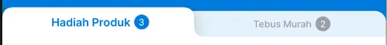

# QuadRoundTabLayout


| Tabs Count & Mode             | Preview                                                  |
|-------------------------------|----------------------------------------------------------|
| **2 Tabs - Fixed**            |         |
| **3 Tabs - Fixed**            |       |
| **4+ Tabs - Scrollable**      |  |

## Basic Usage

### 1. Add to Layout

```xml
<id.co.edtslib.uikit.tablayout.QuadRoundTabLayout
        android:id="@+id/dummyTab"
        android:layout_width="match_parent"
        android:layout_height="wrap_content"
        android:clipToPadding="false"
        app:layout_constraintTop_toBottomOf="@id/toolbar"/>
```

### 2. Initialize in Code

```kotlin
val tabLayout = findViewById<QuadRoundTabLayout>(R.id.tabLayout)

// Create tab items
val tabItems = listOf(
    QuadRoundTabLayout.TabItem(
        title = "Hadiah Produk",
        badge = QuadRoundTabLayout.BadgeConfig(
            text = "3",
            textColor = color(R.color.white),
            backgroundColor = color(id.co.edtslib.uikit.R.color.black_40))
    ),
    QuadRoundTabLayout.TabItem(
        title = "Tebus Murah",
        badge = QuadRoundTabLayout.BadgeConfig(
            text = "2",
            textColor = color(R.color.white),
            backgroundColor = color(id.co.edtslib.uikit.R.color.black_40))
        )
)

// Set tabs
tabLayout.setTabs(tabItems)

// Delegate
tabLayout.delegate = object : QuadRoundTabLayout.Delegate {
    // Will not be called when onPreventSelected return true
    override fun onTabSelected(
        position: Int,
        view: QuadRoundTabLayout.QuadRoundTabView,
        item: QuadRoundTabLayout.TabItem
    ) {
        // Handle tab selection when onPreventSelected return false.
    }

    override fun onPreventSelected(
        position: Int,
        view: QuadRoundTabLayout.QuadRoundTabView,
        item: QuadRoundTabLayout.TabItem
    ): Boolean {
        // Handle manual tab selection when return is true and disable auto tab selection during user click, 
    }
}
```

## Display Modes

| Mode              | Value | Description                                                          | Use Case                              |
|-------------------|-------|----------------------------------------------------------------------|---------------------------------------|
| `MODE_AUTO`       | `2`   | Automatically switches between fixed and scrollable based on content | **Default** - Best for most scenarios |
| `MODE_FIXED`      | `1`   | Tabs distributed equally across available width                      | 2-3 tabs that should fill container   |
| `MODE_SCROLLABLE` | `0`   | Tabs maintain natural width, scroll if needed                        | Many tabs or varying content widths   |

```kotlin
tabLayout.scrollMode = QuadRoundTabLayout.MODE_AUTO
```

## Properties Reference

### Color Properties

| Property                     | Type        | Default            | Description                               |
|------------------------------|-------------|--------------------|-------------------------------------------|
| `rootBackgroundColor`        | `@ColorInt` | `primary_30`       | Background color of the entire component  |
| `containerBackgroundColor`   | `@ColorInt` | `support_selected` | Background color of the tab container     |
| `tabBackgroundColor`         | `@ColorInt` | `support_selected` | Background color of inactive tabs         |
| `activeTabBackgroundColor`   | `@ColorInt` | `white`            | Background color of the active tab        |
| `tabTextColor`               | `@ColorInt` | `black_40`         | Text color for inactive tabs              |
| `activeTextColor`            | `@ColorInt` | `primary_30`       | Text color for the active tab             |
| `activeBadgeBackgroundColor` | `@ColorInt` | `primary_30`       | Background color for badges on active tab |
| `startIconTint`              | `@ColorInt` | `black_40`         | Tint color for tab icons                  |
| `shadowColor`                | `@ColorInt` | `black_60`         | Shadow color for active tab elevation     |

### Dimension Properties

| Property                 | Type    | Default      | Description                  |
|--------------------------|---------|--------------|------------------------------|
| `textPaddingStart`       | `Float` | `dimen.xxxs` | Left padding for tab text    |
| `textPaddingEnd`         | `Float` | `dimen.xxxs` | Right padding for tab text   |
| `tabPaddingStart`        | `Float` | `dimen.s`    | Left padding for entire tab  |
| `tabPaddingEnd`          | `Float` | `dimen.s`    | Right padding for entire tab |
| `startIconSize`          | `Float` | `dimen.s`    | Size of the start icon       |
| `badgeSize`              | `Float` | `dimen.s`    | Size of the badge            |
| `activeElevation`        | `Float` | `dimen.xxs`  | Elevation for the active tab |
| `defaultTabHeight`       | `Float` | `dimen.m3`   | Height of inactive tabs      |
| `defaultActiveTabHeight` | `Float` | `dimen.l`    | Height of the active tab     |

### Text Appearance Properties

| Property               | Type        | Default                            | Description                  |
|------------------------|-------------|------------------------------------|------------------------------|
| `tabTextAppearance`    | `@StyleRes` | `TextAppearance_Inter_Medium_B4`   | Text style for inactive tabs |
| `activeTextAppearance` | `@StyleRes` | `TextAppearance_Inter_Semibold_H3` | Text style for active tab    |
| `badgeTextAppearance`  | `@StyleRes` | `TextAppearance_Inter_SemiBold_B4` | Text style for badges        |

### Behavior Properties

| Property             | Type                            | Default     | Description                              |
|----------------------|---------------------------------|-------------|------------------------------------------|
| `shouldAnimate`      | `Boolean`                       | `false`     | Enable/disable tab transition animations |
| `isStartIconVisible` | `Boolean`                       | `false`     | Show/hide icons in tabs                  |
| `scrollMode`         | `@QuadRoundTabLayoutScrollMode` | `MODE_AUTO` | Tab layout behavior mode                 |

## Data Classes

### TabItem

| Property  | Type                | Required | Description                  |
|-----------|---------------------|----------|------------------------------|
| `title`   | `String`            | ✅        | Display text for the tab     |
| `iconRes` | `@DrawableRes Int?` | ❌        | Optional icon resource       |
| `badge`   | `BadgeConfig?`      | ❌        | Optional badge configuration |

```kotlin
QuadRoundTabLayout.TabItem(
    title = "Messages",
    iconRes = R.drawable.ic_message,
    badge = BadgeConfig(text = "5", backgroundColor = Color.RED, textColor = Color.WHITE)
)
```

### BadgeConfig

| Property             | Type        | Required   | Description                                      |
|----------------------|-------------|------------|--------------------------------------------------|
| `text`               | `String`    | ✅          | Text to display in badge                         |
| `backgroundColor`    | `@ColorInt` | ✅          | Badge background color                           |
| `textColor`          | `@ColorInt` | ✅          | Badge text color                                 |
| `currentSelectedTab` | `Int`       | ❌ Optional | Programmatically Select Tab based on Index Given |

## Methods Reference

### Public Methods

| Method        | Parameters                                               | Description                                           |
|---------------|----------------------------------------------------------|-------------------------------------------------------|
| `setTabs()`   | `tabItems: List<TabItem>`                                | Set the tabs to display                               |
| `selectTab()` | `position: Int, animate: Boolean = false, item: TabItem` | Programmatically select a tab with custom item to set |
| `selectTab()` | `position: Int, animate: Boolean = false`                | Programmatically select a tab                         |

### Usage Examples

```kotlin
// Set tabs
tabLayout.setTabs(listOf(
    TabItem("Tab 1"),
    TabItem("Tab 2", R.drawable.ic_profile),
    TabItem("Tab 3")
))

// Select specific tab with animation and custom tab item
tabLayout.selectTab(1, animate = true, tabItems[1])

// Select tab without animation
tabLayout.selectTab(0, animate = false)
```

### Delegate 
| Function                                                   | Description                                                                                                                                        |
|------------------------------------------------------------|----------------------------------------------------------------------------------------------------------------------------------------------------|
| `onPreventSelected(Int,QuadRoundTabView,TabItem): Boolean` | Called before a tab is selected. Return true to block the selection to disable user click. Return false to allow it and proceed to onTabSelected() |
| `onTabSelected(Int,QuadRoundTabView,TabItem)`              | Called if onPreventSelected() return false . Use this to handle what should happen when a user selects a tab.                                      |

## Customization Examples

### Color Customization

```kotlin
tabLayout.apply {
    rootBackgroundColor = ContextCompat.getColor(context, R.color.primary_30)
    tabBackgroundColor = ContextCompat.getColor(context, R.color.surface)
    activeTabBackgroundColor = ContextCompat.getColor(context, R.color.primary)
    tabTextColor = ContextCompat.getColor(context, R.color.on_surface)
    activeTextColor = ContextCompat.getColor(context, R.color.on_primary)
}
```

### Dimension Customization

```kotlin
tabLayout.apply {
    textPaddingStart = 16.dp
    textPaddingEnd = 16.dp
    tabPaddingStart = 24.dp
    tabPaddingEnd = 24.dp
    startIconSize = 20.dp
    badgeSize = 16.dp
    activeElevation = 8.dp
}
```

## Performance Considerations

| Feature          | Implementation                                | Benefit                   |
|------------------|-----------------------------------------------|---------------------------|
| **View Pooling** | `Pools.SynchronizedPool<QuadRoundTabView>(8)` | Reduced memory allocation |

## Animation Details

| Animation            | Duration  | Interpolator | Description                 |
|----------------------|-----------|--------------|-----------------------------|
| **Tab Transition**   | 250ms     | Default      | Active indicator movement   |
| **Width Changes**    | Immediate | N/A          | Tab expansion/contraction   |
| **Scroll Animation** | Default   | Smooth       | Auto-scroll to selected tab |

## Best Practices

### Do's and Don'ts

| ✅ Do                                | ❌ Don't                  |
|-------------------------------------|--------------------------|
| Keep tab titles concise (1-2 words) | Use very long tab titles |
| Test on different screen sizes      | Assume one size fits all |

---

> **⚠️ Note**: This component is under active development. XML attribute support and additional customization options will be added in future releases. The current programmatic approach will remain fully supported for backward compatibility.