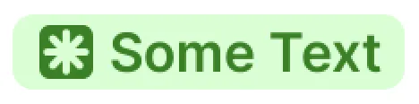

# Text Badge

`TextBadge` is a badge component built on top of `FrameLayout` that displays short text labels with customizable styling, shapes, icons, colors, and sizing. It is designed for status indicators, labels, highlights, tags, and other compact informational elements.

---

## Features

* Gradient background support
* Relative width support
* XML and programmatic configuration
* Disabled-state styling

---

### Badge Shapes

| Badge Shape   | Description                                                                            | Preview     | Disabled Preview     |
| ------------- | -------------------------------------------------------------------------------------- | ----------- | ----------- |
| **Status**    | Standard rounded badge for statuses and labels. Uses 4dp corner radius on all corners. |       |       |
| **Highlight** | Banner-like badge with an emphasized bottom-right corner.                              |    |       |

---

## Badge Sizes

| Size | Description | Icon Size | Default Text Style | Horizontal Padding | Vertical Padding |
|------|-------------|------------|---------------------|---------------------|-------------------|
| **Small** | Compact badge for dense layouts. | 10dp | `TextAppearance_Inter_SemiBold_TextBadge` | 4dp | 2dp |
| **Medium** | Default badge size. | 12dp | `TextAppearance_Inter_SemiBold_B4` | 4dp | 1dp |
| **Large** | Larger vertical padding for emphasis. | 12dp | `TextAppearance_Inter_SemiBold_B4` | 4dp | 3dp |

---

## Usage

### XML Usage

```xml
<id.co.edtslib.uikit.badge.TextBadge
    android:layout_width="wrap_content"
    android:layout_height="wrap_content"
    app:badgeText="New"
    app:badgeSize="medium"
    app:badgeShape="status"/>
```


### Programmatic Usage

```kotlin
badge.text = "Active"
badge.badgeShape = TextBadge.BadgeShape.STATUS
badge.badgeSize = TextBadge.BadgeSize.MEDIUM
```

---

## Icon Support

Icons can be displayed before the text.

### Icon Customization

| Property      | Description       |
| ------------- | ----------------- |
| `iconVisible` | Show or hide icon |
| `iconSize`    | Icon size in dp   |
| `iconColor`   | Icon tint color   |

Example:

```kotlin
badge.setIcon(R.drawable.ic_check)
badge.iconVisible = true
badge.iconSize = 16
badge.iconColor = Color.WHITE
```

```xml
<id.co.edtslib.uikit.badge.TextBadge
    android:layout_width="wrap_content"
    android:layout_height="wrap_content"
    app:startIcon="@drawable/ic_info"
    app:startIconVisible="true"
    app:startIconColor="@color/info"
    app:startIconSize="12"/>
```

---

## Text Styling

### Text Content

```kotlin
badge.text = "Some Text"
```

### Text Color

```kotlin
badge.textColor = Color.WHITE
```
---

### Text Appearance

```kotlin
badge.badgeTextAppearance =
    R.style.TextAppearance_Inter_SemiBold_B4
```

### Custom Typeface

```kotlin
badge.fontFamily = ResourcesCompat.getFont(
    context,
    R.font.inter_semibold
)
```

---

## Background Styling

### Solid Color

```kotlin
badge.badgeColor = Color.parseColor("#FFF3CD")
```

### Gradient Background

```kotlin
badge.setGradientBackground(
    intArrayOf(
        Color.RED,
        Color.BLUE
    )
)
```

---

## Corner Radius

### Uniform Radius

```kotlin
badge.setCornerRadius(8f)
```

### Individual Radius

```kotlin
badge.setCornerRadius(
    topLeft = 8f,
    topRight = 8f,
    bottomLeft = 0f,
    bottomRight = 12f
)
```

---

## Padding

### Programmatic

```kotlin
badge.setBadgePadding(
    horizontal = 8,
    vertical = 4
)
```

### XML

| Attribute           | Description        |
| ------------------- | ------------------ |
| `paddingHorizontal` | Horizontal padding |
| `paddingVertical`   | Vertical padding   |

Values are specified in dp.

---

## Relative Width

The badge can occupy a percentage of its parent width.

```kotlin
badge.relativeWidth = 50
```

This makes the badge use 50% of the measured parent width.

Valid range:

```text
0 - 100
```

Values outside the range or `null` are automatically set width to `wrap content`.

---

## Disabled State

When disabled:

```kotlin
badge.isEnabled = false
```

The badge automatically:

* Changes text color to white
* Updates icon tint
* Applies disabled background colors

---

## XML Attributes

| Attribute | Type | Description |
|------------|------|-------------|
| `badgeText` | `String` | Badge text |
| `badgeShape` | `enum (STATUS, HIGHLIGHT)` | Badge shape variant |
| `badgeSize` | `enum (SMALL, MEDIUM, LARGE)` | Badge size preset |
| `textAppearance` | `@style` | Text appearance resource |
| `textColor` | `color` | Badge text color |
| `backgroundColor` | `color` | Badge background color |
| `startIcon` | `drawable` | Start icon drawable |
| `startIconVisible` | `boolean` | Controls icon visibility |
| `startIconColor` | `color` | Icon tint |
| `startIconSize` | `dimension (dp)` | Icon size |
| `paddingHorizontal` | `dimension (dp)` | Horizontal padding |
| `paddingVertical` | `dimension (dp)` | Vertical padding |
| `cornerRadius` | `dimension (dp)` | Radius applied to all corners |
| `topLeftCornerRadius` | `dimension (dp)` | Top-left corner radius |
| `topRightCornerRadius` | `dimension (dp)` | Top-right corner radius |
| `bottomLeftCornerRadius` | `dimension (dp)` | Bottom-left corner radius |
| `bottomRightCornerRadius` | `dimension (dp)` | Bottom-right corner radius |
| `relativeWidth` | `integer (0-100)` | Width percentage relative to parent |

---