# Text Badge

This document outlines the text badge component available in the UI Kit. `CoreTextBadge` is the base implementation, and each product ships its own **recipe** — a themed subclass that exposes a curated set of variants (shape + preset + palette) tailored to that product. Currently available recipes are **Klik** (`KlikTextBadge`) and **Poinku** (`PoinkuTextBadge`).

## Architecture

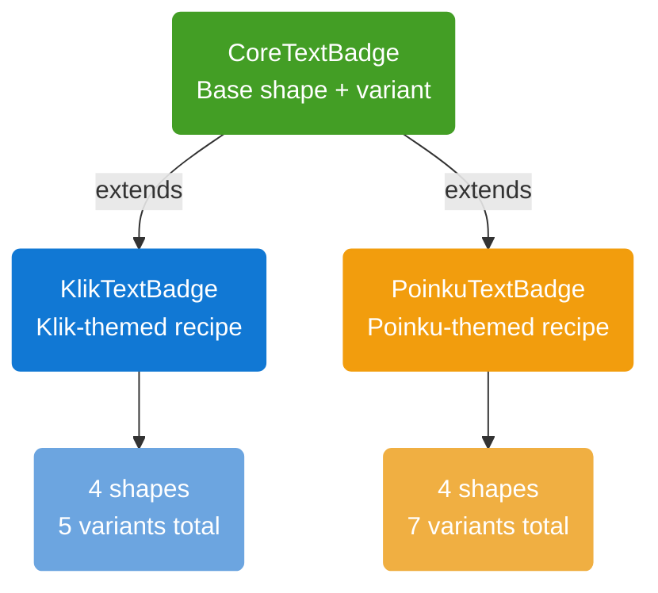
```mermaid
graph TD
    Core("CoreTextBadge<br/>Base shape + variant")
    Klik("KlikTextBadge<br/>Klik-themed recipe")
    Poinku("PoinkuTextBadge<br/>Poinku-themed recipe")
    KlikShapes("4 shapes<br/>5 variants total")
    PoinkuShapes("4 shapes<br/>7 variants total")

    Core -->|extends| Klik
    Core -->|extends| Poinku
    Klik -->KlikShapes
    Poinku --> PoinkuShapes


    style Core fill:#439E25,stroke:#439E25,color:#fff
    style Klik fill:#1178D4,stroke:#1178D4,color:#fff
    style Poinku fill:#F29D0D,stroke:#F29D0D,color:#fff
    style KlikShapes fill:#6CA5E0,stroke:#6CA5E0,color:#fff
    style PoinkuShapes fill:#F0AF42,stroke:#F0AF42,color:#fff
```

| Class          | Role                                                                                                                 |
|----------------|----------------------------------------------------------------------------------------------------------------------|
| `BadgeShape`   | Defines a shape's corner radius.                                                                                     |
| `BadgePreset`  | Geometry for a variant: horizontal/vertical padding, icon size, text appearance, drawable padding, and border width. |
| `BadgePalette` | Optional color set: background, text, icon, border colors, or gradient colors + orientation.                         |
| `BadgeVariant` | Combines a `BadgeShape` + `BadgePreset` + optional `BadgePalette`/`disabledPalette` into one applyable unit.         |


Product recipes (e.g. `id.co.edtslib.uikit.recipes.textbadge.klik`, `id.co.edtslib.uikit.recipes.textbadge.poinku`) implement `BadgeShape` and `BadgeVariant`, and subclass `CoreTextBadge` to:
- theme the view with a product-specific `ThemeOverlay`,
- default to a sensible variant when none is set from XML,
- expose a typed variant property (`klikVariant`, `poinkuVariant`),
- override `variantFromStyle()` to map XML style resources to the product's `BadgeVariant` values.

## CoreTextBadge

`CoreTextBadge` is a `FrameLayout`-based component that Klik and Poinku badges are built on. It renders a text badge with all styling driven by a small, product-agnostic recipe system.

### Features

- **Recipe-driven styling**: A `BadgeVariant` bundles a `BadgeShape`, a `BadgePreset` (padding/icon size/text style), and an optional `BadgePalette` (colors) into a single settable property, so switching a badge's whole look is one assignment.
- **Disabled state handling**: Every shape (and optionally every variant) can define its own `disabledPalette`, so disabling the badge automatically swaps in the correct muted colors without extra code.
- **Relative width**: The badge can be constrained to a percentage of its parent's width via `relativeWidth`.
- **Extensible**: New products add a recipe package (`Shape` + `Variant` + a themed `TextBadge` subclass) without modifying `CoreTextBadge`.

### Preview

| Badge State  | Preview                                               |
|--------------|-------------------------------------------------------|
| **Default**  |    |
| **Disabled** | 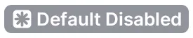 |

### Properties

| Property                     | Type                 | Default Value                              | Description                                                                           |
|------------------------------|----------------------|--------------------------------------------|---------------------------------------------------------------------------------------|
| `text`                       | `String?`            | `"Text Badge"`                             | The badge's label. Setting it to `null`/empty hides the badge (`visibility = GONE`).  |
| `textColor`                  | `Int` (`@ColorInt`)  | `R.color.foundation_color_neutral_white`   | Text color.                                                                           |
| `badgeColor`                 | `Int` (`@ColorInt`)  | `R.color.foundation_color_primary_blue_30` | Solid background color. Clears any gradient background when set.                      |
| `badgeTextAppearance`        | `Int` (`@StyleRes`)  | `R.style.TextAppearance_Inter_SemiBold_B4` | Text appearance style applied to the label.                                           |
| `fontFamily`                 | `Typeface`           | `R.font.inter_semibold`                    | Typeface applied to the label.                                                        |
| `iconVisible`                | `Boolean`            | `false`                                    | Shows or hides the leading icon.                                                      |
| `iconSize`                   | `Int`                | `12` (dp)                                  | Icon size in dp.                                                                      |
| `iconColor`                  | `Int?` (`@ColorInt`) | `R.color.foundation_color_neutral_white`   | Icon tint color.                                                                      |
| `iconPadding`                | `Int`                | `4` (dp)                                   | Space (px) between the icon and the text.                                             |
| `relativeWidth`              | `Int?`               | `null`                                     | Constrains badge width to a percentage (0–100) of its parent's measured width.        |
| `borderWidth`                | `Float`              | `0f`                                       | Border stroke width.                                                                  |
| `borderColor`                | `Int` (`@ColorInt`)  | `Color.TRANSPARENT`                        | Border stroke color.                                                                  |
| `shadowOpacity`              | `Float`              | `0f`                                       | Drop shadow opacity, `0f`–`1f`.                                                       |
| `shadowOffsetX/Y`            | `Float`              | `0f`                                       | Drop shadow horizontal/vertical offset.                                               |
| `shadowRadius`               | `Float`              | `0f`                                       | Drop shadow blur radius.                                                              |
| `shadowColor`                | `Int` (`@ColorInt`)  | `Color.TRANSPARENT`                        | Drop shadow color.                                                                    |
| `badgeShape` *(protected)*   | `BadgeShape`         | `DefaultShape()`                           | The active shape; setting it updates corner radii and re-applies appearance.          |
| `badgeVariant` *(protected)* | `BadgeVariant?`      | `null`                                     | The active composite variant; setting it applies shape, preset, and palette together. |

### Methods

| Method                                                                                               | Description                                                      |
|------------------------------------------------------------------------------------------------------|------------------------------------------------------------------|
| `setIcon(@DrawableRes drawableRes: Int)` / `setIcon(drawable: Drawable?)`                            | Sets the leading icon drawable.                                  |
| `setGradientBackground(colors: IntArray, orientation: GradientDrawable.Orientation)`                 | Applies a gradient background, replacing any solid `badgeColor`. |
| `setCornerRadius(all: Float)` / `setCornerRadius(topLeft, topRight, bottomLeft, bottomRight: Float)` | Sets corner radii (dp) for one or all corners.                   |
| `setBadgePadding(horizontal: Int, vertical: Int)` / `setBadgePadding(left, top, right, bottom: Int)` | Sets internal padding (dp), symmetrically or per-side.           |
| `setCoreShape(shape: BadgeShape)`                                                                    | Public setter for `badgeShape` from outside the class.           |

### XML Attributes

| Attribute                 | Type                   | Description                                                                                           |
|---------------------------|------------------------|-------------------------------------------------------------------------------------------------------|
| `coreTextBadgeStyle`      | `reference (style)`    | Recipe style applied to theme the badge. Defaults to `Widget.EDTS.UIKit.TextBadge.Core`.              |
| `badgeShape`              | `reference (style)`    | Resolves to a `BadgeShape` via `badgeShapeFromStyle()`.                                               |
| `badgeVariant`            | `reference (style)`    | Resolves to a `BadgeVariant` via `variantFromStyle()`; applies shape + preset + palette together.     |
| `badgeText`               | `string`               | Badge label text. Defaults to `"Text Badge"`.                                                         |
| `textAppearance`          | `reference (style)`    | Text appearance style applied to the label.                                                           |
| `textColor`               | `color`                | Badge text color.                                                                                     |
| `backgroundColor`         | `color`                | Solid badge background color.                                                                         |
| `startIcon`               | `reference (drawable)` | Leading icon drawable.                                                                                |
| `startIconVisible`        | `boolean`              | Shows or hides the leading icon.                                                                      |
| `iconTint`                | `color`                | Leading icon tint color.                                                                              |
| `iconSize`                | `integer (dp)`         | Leading icon size.                                                                                    |
| `relativeWidth`           | `integer (0–100)`      | Width as a percentage of the parent's measured width.                                                 |
| `strokeWidth`             | `dimension`            | Border stroke width.                                                                                  |
| `strokeColor`             | `color`                | Border stroke color.                                                                                  |
| `badgeShadowOpacity`      | `float`                | Drop shadow opacity, `0`–`1`.                                                                         |
| `badgeShadowOffsetX`      | `dimension`            | Drop shadow horizontal offset.                                                                        |
| `badgeShadowOffsetY`      | `dimension`            | Drop shadow vertical offset.                                                                          |
| `badgeShadowRadius`       | `dimension`            | Drop shadow blur radius.                                                                              |
| `badgeShadowColor`        | `color`                | Drop shadow color.                                                                                    |
| `iconPadding`             | `dimension`            | Space between the icon and the text.                                                                  |
| `cornerRadius`            | `dimension`            | Radius applied to all four corners; overridden by the individual corner attributes below if also set. |
| `topLeftCornerRadius`     | `dimension`            | Top-left corner radius.                                                                               |
| `topRightCornerRadius`    | `dimension`            | Top-right corner radius.                                                                              |
| `bottomLeftCornerRadius`  | `dimension`            | Bottom-left corner radius.                                                                            |
| `bottomRightCornerRadius` | `dimension`            | Bottom-right corner radius.                                                                           |


### Usage

1. Prefer using a product recipe (`KlikTextBadge`, `PoinkuTextBadge`) rather than `CoreTextBadge` directly, so the badge inherits the correct theme and default variant.
2. Set the badge's look via `app:badgeVariant` in XML, or the recipe's typed property (`klikVariant`, `poinkuVariant`) at runtime.
3. Set `app:badgeText` (or the `text` property) to control the label.
4. Use `app:startIconVisible`, `app:iconTint`, and `app:iconSize` to configure the leading icon, or leave the variant's preset to manage the icon size automatically.

```xml
<id.co.edtslib.uikit.recipes.textbadge.klik.KlikTextBadge
    android:id="@+id/badgePromo"
    android:layout_width="wrap_content"
    android:layout_height="wrap_content"
    app:badgeVariant="@style/Widget.EDTS.UIKit.TextBadge.Klik.Promo"
    app:badgeText="Flash Sale"
    app:startIconVisible="true"
    app:startIcon="@drawable/ic_bolt"/>
```

```kotlin
badgePromo.klikVariant = KlikVariant.Promo.DEFAULT
badgePromo.text = "Flash Sale"
badgePromo.iconVisible = true
badgePromo.setIcon(R.drawable.ic_bolt)
```

To disable a badge and let its variant's (or shape's) `disabledPalette` take over automatically:

```kotlin
badgePromo.isEnabled = false
```


## Klik Text Badge

`KlikTextBadge` exposes four shapes — **Promo**, **Fair**, **Highlight**, and **Quota** — covering promotional, deal, banner-callout, and quota-tracking use cases. **Fair** is the only shape with two sizes (`SMALL`/`BIG`); the rest are single-size. **Highlight** is also the only preset with asymmetric horizontal padding (`left = 4dp`, `right = 3dp`).

| Badge Style    | Style Resource                                | Kotlin Variant                  | Preview                                              | Disabled Preview                                                       |
|----------------|-----------------------------------------------|---------------------------------|------------------------------------------------------|------------------------------------------------------------------------|
| **Promo**      | `Widget.EDTS.UIKit.TextBadge.Klik.Promo`      | `KlikVariant.Promo.DEFAULT`     |            | 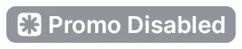           |
| **Fair Small** | `Widget.EDTS.UIKit.TextBadge.Klik.Fair.Small` | `KlikVariant.Fair.SMALL`        |  | 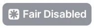 |
| **Fair Big**   | `Widget.EDTS.UIKit.TextBadge.Klik.Fair.Big`   | `KlikVariant.Fair.BIG`          |      | 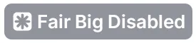     |
| **Highlight**  | `Widget.EDTS.UIKit.TextBadge.Klik.Highlight`  | `KlikVariant.Highlight.DEFAULT` |    |    |
| **Quota**      | `Widget.EDTS.UIKit.TextBadge.Klik.Quota`      | `KlikVariant.Quota.DEFAULT`     | 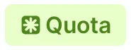           | 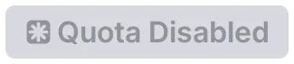           |

**Implementation**:
```xml
<id.co.edtslib.uikit.recipes.textbadge.klik.KlikTextBadge
    android:id="@+id/badgeKlikPromo"
    android:layout_width="wrap_content"
    android:layout_height="wrap_content"
    app:badgeVariant="@style/Widget.EDTS.UIKit.TextBadge.Klik.Promo"
    app:badgeText="New"/>
```
Or set the variant at runtime:
```kotlin
klikBadge.klikVariant = KlikVariant.Highlight.DEFAULT
klikBadge.text = "50% OFF"
```

## Poinku Text Badge

`PoinkuTextBadge` exposes four shapes: **Loyalty**, **Coupon**, and **Currency** (each with a `Full` and `Lite` variant), plus a single standalone **Freeform** variant. **Coupon Full** and **Currency Full** are the only presets with a 1dp `borderWidth`, using the palette's `borderColorRes` for the stroke; the `Lite` counterparts are borderless.

| Badge Style       | Style Resource                                     | Kotlin Variant                | Preview                                                      | Disabled Preview                                                               |
|-------------------|----------------------------------------------------|-------------------------------|--------------------------------------------------------------|--------------------------------------------------------------------------------|
| **Loyalty Full**  | `Widget.EDTS.UIKit.TextBadge.Poinku.Loyalty.Full`  | `PoinkuVariant.Loyalty.Full`  |         | —                                                                              |
| **Loyalty Lite**  | `Widget.EDTS.UIKit.TextBadge.Poinku.Loyalty.Lite`  | `PoinkuVariant.Loyalty.Lite`  | 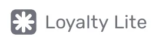   | —                                                                              |
| **Coupon Full**   | `Widget.EDTS.UIKit.TextBadge.Poinku.Coupon.Full`   | `PoinkuVariant.Coupon.Full`   |      | 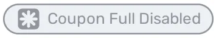     |
| **Coupon Lite**   | `Widget.EDTS.UIKit.TextBadge.Poinku.Coupon.Lite`   | `PoinkuVariant.Coupon.Lite`   |      | 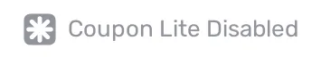     |
| **Currency Full** | `Widget.EDTS.UIKit.TextBadge.Poinku.Currency.Full` | `PoinkuVariant.Currency.Full` |  | 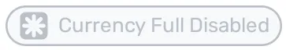 |
| **Currency Lite** | `Widget.EDTS.UIKit.TextBadge.Poinku.Currency.Lite` | `PoinkuVariant.Currency.Lite` | 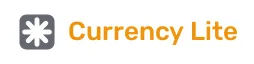 | 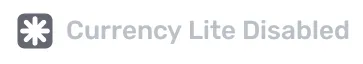 |
| **Freeform**      | `Widget.EDTS.UIKit.TextBadge.Poinku.Freeform`      | `PoinkuVariant.Freeform`      |            | 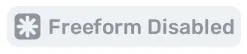           |

**Implementation**:
```xml
<id.co.edtslib.uikit.recipes.textbadge.poinku.PoinkuTextBadge
    android:id="@+id/badgePoinkuLoyalty"
    android:layout_width="wrap_content"
    android:layout_height="wrap_content"
    app:badgeVariant="@style/Widget.EDTS.UIKit.TextBadge.Poinku.Loyalty.Full"
    app:badgeText="1,200 pts"/>
```
Or set the variant at runtime:
```kotlin
poinkuBadge.poinkuVariant = PoinkuVariant.Coupon.Lite
poinkuBadge.text = "SAVE10"
```