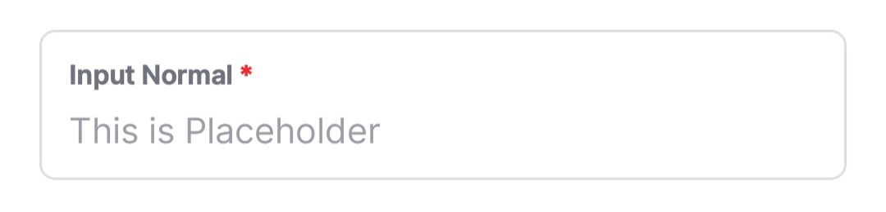
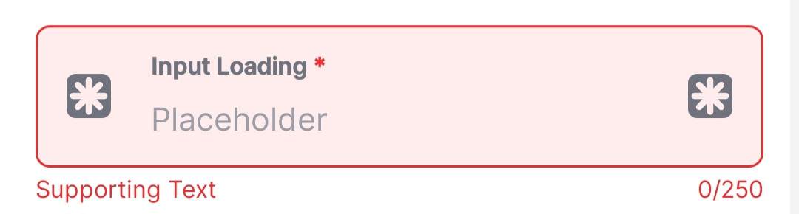
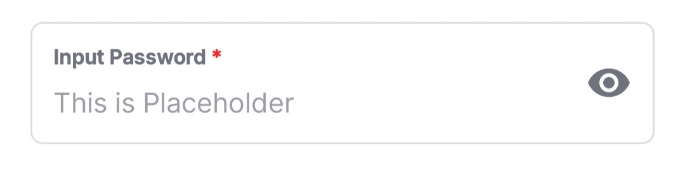
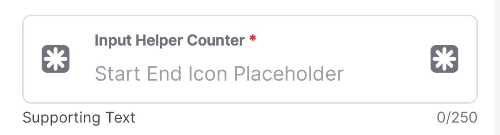
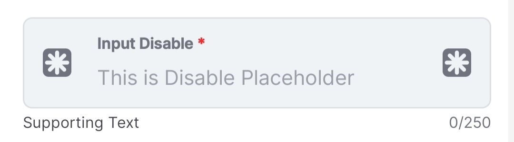
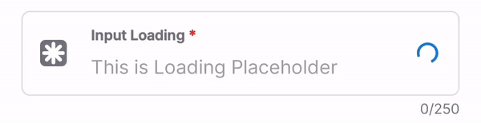

TextField
=========

`TextField` is a custom text input component extending Android's `TextInputLayout`. It provides built-in validation, error handling, and customizable input types for a flexible user experience.

* * * * *

Overview
--------

Built on Material Design's `TextInputLayout`, `TextField` wraps a `TextInputEditText` and supports:

-   Error handling with animations and haptic feedback

-   Configurable maximum character lengths

-   Dynamic hint modification for required fields (adds `*` to hint)

-   Delegated callbacks for text changes

* * * * *

Common Use Cases
----------------

Example XML: [Source Code](https://github.com/shidiq-uxe/edts-ui-kit/blob/main/app/src/main/res/layout/activity_textfield.xml)

1.  **Standard Input**\
    

2.  **Start Icon Input**\
    

3.  **Start & End Icons**\
    

4.  **Error State**\
    

5.  **Password Input** (visibility toggle)\
    

6.  **Helper Text & Character Counter**\
    

7.  **Disabled Input**\
    

8.  **Loading State**\
    

* * * * *

Features
--------

### Input Types (`InputType` enum)

-   `Text`, `Password`, `Pin`, `Phone`, `Email`, `OTP`

### IME Options (`ImeOption` enum)

-   `Next`, `Send`, `Search`, `Done`

### Other Features

-   **Error Handling:** Automatically updates styling, triggers haptic feedback

-   **Text Change Delegate:** Listens for changes via `delegate`

-   **Max Length Filtering:** Enforces character limits dynamically

* * * * *

Usage
-----

### XML Integration

```xml
<id.co.edtslib.uikit.textfield.TextField
    style="@style/Widget.EDTS.UIKit.TextInputLayout.LabelInside"
    android:layout_width="match_parent"
    android:layout_height="wrap_content"
    android:hint="Input Normal"
    app:placeholderText="Start End Icon Placeholder"
    app:startIconDrawable="@drawable/ic_placeholder_medium_24"
    app:endIconDrawable="@drawable/ic_placeholder_medium_24"
    app:endIconMode="custom" />
```

### Programmatic Usage (Kotlin)

```kotlin
val textField = binding.tfInput.apply {
    delegate = object : TextFieldDelegate {
        override fun onValueChange(value: String?) {
            println("New value: $value")
        }
    }
    inputType = TextField.InputType.Email
    imeOption = TextField.ImeOption.Done
    maxLength = 50
}
```

* * * * *

Custom Attributes
-----------------

| Attribute                          | Type    | Description                                   |
|------------------------------------|---------|-----------------------------------------------|
| `app:fieldInputType`               | Integer | Defines input type (`Text`, `Password`, etc.) |
| `app:fieldImeOptions`              | Integer | Sets IME action (`Next`, `Send`, etc.)        |
| `app:fieldMaxLength`               | Integer | Maximum character limit (0 to disable)        |
| `app:isFieldRequired`              | Boolean | Appends `*` to hint if true                   |
| `app/android:[MaterialAttributes]` | Various | Inherits Material Design attributes           |

* * * * *

Properties & Methods
--------------------

### Properties

-   `delegate: TextFieldDelegate?` → Listens for text changes

-   `isFieldRequired: Boolean` → Appends `*` to hint if true

-   `inputType: InputType` → Defines input behavior

-   `imeOption: ImeOption` → Sets IME action button

-   `maxLength: Int` → Limits character count

-   `textInputError: TextView?` → Access error text view

### Methods

-   `setError(errorText: CharSequence?)` → Updates error styling & triggers feedback

-   `isHelperTextEnabled(): Boolean` → Checks helper text visibility

* * * * *

Error Handling
--------------

When `setError` is called:

-   Changes helper text color

-   Enables error styling & flag

-   Updates text color for OTP inputs

-   Adjusts line height to fit design

-   Triggers haptic feedback

* * * * *

Customization & Styling
-----------------------

-   **Required Field Indicator**: Adds `*` to hints for mandatory fields

-   **Input Filters**: Applies/removes filters dynamically

-   **End Icon Behavior**: Toggles password visibility

-   **Dynamic Padding**: Adjusts padding based on errors

* * * * *

Notes & Requirements
--------------------

-   Customizable via properties while maintaining internal consistency

-   Follows Material Design guidelines for TextInputLayout